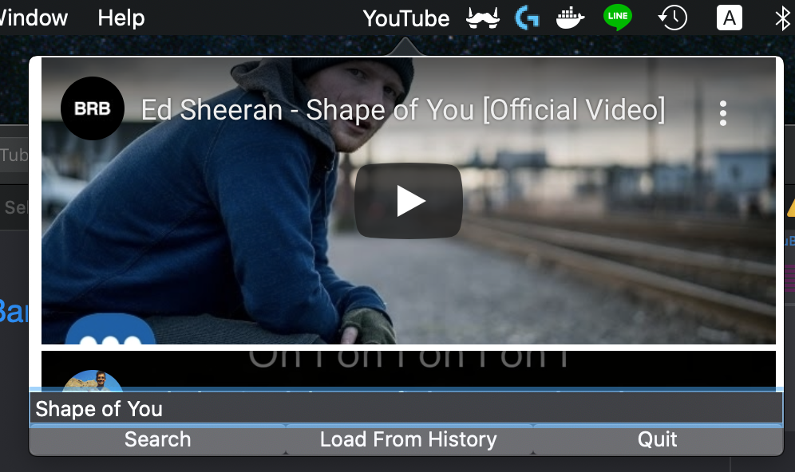
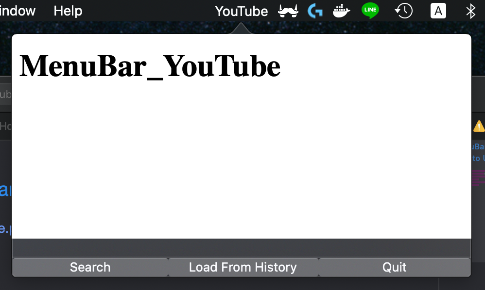

# MenuBar YouTube
## add Icon in macOS MenuBar and play YouTube video on popover view

# How to Use?
Show MenuBar_YouTube.app/Contents/Resources/ in Finder
and open APIKey.txt and save Your Google YouTubeDataAPIv3 APIKey
You can get APIKey Here
<https://console.developers.google.com/apis/>

Then you finish save APIKey
Open This App, then you will see view like this first

1. Enter keyword in the SearchField
2. Click Search 
3. The Embedded YouTube Player will be displayed 

## Edit settings.json 
You can edit setting about Video Player 
Open MenuBar_YouTube.app/Contents/Resources/settings.json

This is defeult value
~~~
settings.json
{
    // Here Set the display videos Max:4 Min:1
    "max_display_video":"4",
    // Here Set the display video's width
    "video_width":"460",
    // Here Set the display video's height
    "video_height":"180"
}
~~~
